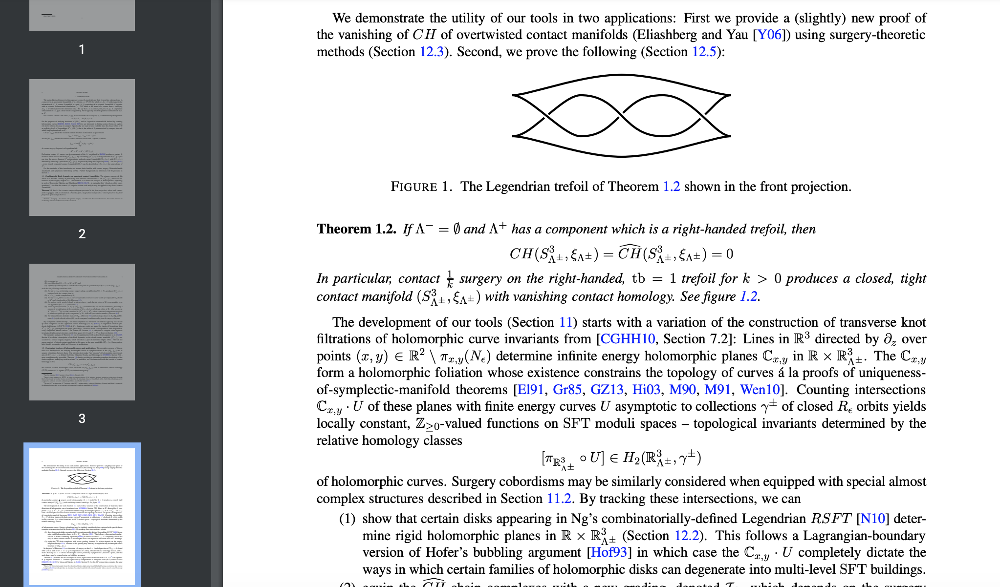

# Note friendly PDF

["...I have discovered a truly marvelous proof of this, which this margin is too narrow to contain."](https://en.wikipedia.org/wiki/Fermat%27s_Last_Theorem)

I want to modify PDFs with enough blank space to write lots of notes, either on a printout or using some drawing software. Margins are usually too tiny to write out a complete thought! This tool can

- take a PDF file on your computer,
- insert a blank page in every other page, then
- write out the expanded document as a new PDF file in landscape view.

Here is an example of an incredibly interesting math paper I downloaded from the arXiv. Here's what the file looks like in Chrome's file viewer:


The content of the paper appears dubious, so I'll want plenty of space to jot down my suspicions. The margins don't provide me enough space.
I run the following command to make an edited file with lots of blank space...
```
python main.py ~/Downloads/2005.11428.pdf
```
which will create a new file, `~/Downloads/2005.11428_notes.pdf` which looks like this:


## Basic usage

After downloading the code, install the requirements within a virtual env:
```
python3 -m venv venv
source venv/bin/activate
pip install -r requirements.txt
```

Now you are ready to use the tool. A help menu will guide you:
```
python main.py --help
```
The only options available allow you to select pages of interest (which might come from a big document). If you want to only use pages 10-11 and 40-45, use the command:
```
python main.py ~/Downloads/2005.11428.pdf -s 10 11 -s 40 45
```
